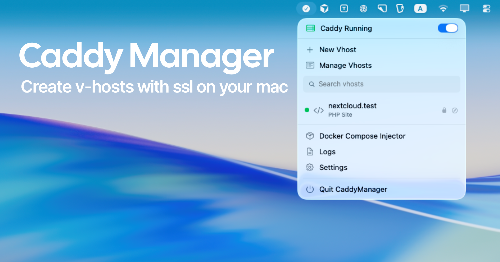

<p align="center">
  
</p>

<p align="center">
  <strong>macOS menu bar app</strong> that runs <strong>one</strong> <a href="https://caddyserver.com">Caddy</a> process for local development.
</p>

<p align="center">
  
  
  
</p>

Caddock is a Valet-style local server for people who already like Caddy. You define virtual hosts in the menu bar. The app writes one shared Caddyfile, hot-reloads a single Caddy instance, and optionally maps `*.test` (and friends) onto ports 80 and 443.

One Caddy process. Not one process per site.

## Features

- **Static, PHP, and reverse proxy** vhosts (`file_server`, `php_fastcgi`, `reverse_proxy`)
- **Menu bar first:** start/stop Caddy, search hosts, open in the browser, jump to logs
- **HTTPS** via Caddy `tls internal`, with Root CA trust from the GUI (not `sudo`)
- **Privileged helper** for `/etc/hosts`, `pf` redirects (`80 → 8880`, `443 → 8843`), and `/etc/resolver`
- **Wildcard DNS** (`*.app.test`) via a local responder on port 53535
- **Health checks** for enabled vhosts
- **Docker Compose injector:** `extra_hosts` plus a copy of the local Root CA
- **Setup wizard:** install Caddy from Homebrew or GitHub, enable the helper, trust the CA

Not Mac App Store. No App Sandbox. Distributed as a Developer ID, notarized DMG when signed.

## Requirements

- macOS 15 Sequoia or later
- [Caddy 2](https://caddyserver.com) (Homebrew, or downloaded in-app)
- Optional: privileged helper for ports 80/443, hosts, and wildcards

## Usage

1. Launch Caddock. The setup wizard installs Caddy, offers the privileged helper, and trusts the local CA.
2. Click **New Vhost** in the menu bar.
3. Pick a type:
   - **Static Site:** folder served with `file_server`
   - **PHP Site:** `php_fastcgi` to a Unix socket or `127.0.0.1:9000`
   - **Reverse Proxy:** forward to a local process, e.g. `127.0.0.1:3000`
4. Use a reserved TLD: `.test`, `.localhost`, `.example`, `.invalid`, `.local` (Bonjour warning).
5. Toggle Caddy on. Open the domain from the menu.

Without the helper, sites listen on high ports (`:8880` / `:8843`). With the helper enabled, `http://myproject.test` and `https://myproject.test` work on 80/443.

## Build

```bash
xcodebuild -project Caddock.xcodeproj -scheme Caddock -configuration Debug build
open Caddock.xcodeproj
```

## Release DMG

Needs a **Developer ID Application** certificate and notary credentials.

```bash
./scripts/release.sh
./scripts/release.sh --skip-notarize
./scripts/release.sh --skip-notarize --skip-sign
```

Output: `dist/Caddock-<version>.dmg`

## How it works

```
Menu bar  →  Caddyfile  →  caddy adapt  →  POST /load  →  one Caddy process
                 ↓
        privileged helper (optional)
        /etc/hosts  ·  pf rdr  ·  /etc/resolver
```

| | Default |
|---|---|
| HTTP | `8880` (helper maps 80) |
| HTTPS | `8843` (helper maps 443) |
| Admin API | `127.0.0.1:2019` |

Architecture notes for contributors live in [`REBUILD_SPEC.md`](REBUILD_SPEC.md).

## Identity

| | |
|---|---|
| App bundle ID | `dev.mahmudz.Caddock` |
| Helper bundle ID | `dev.mahmudz.Caddock.Helper` |
| Team ID | `SP792GFSPZ` |
